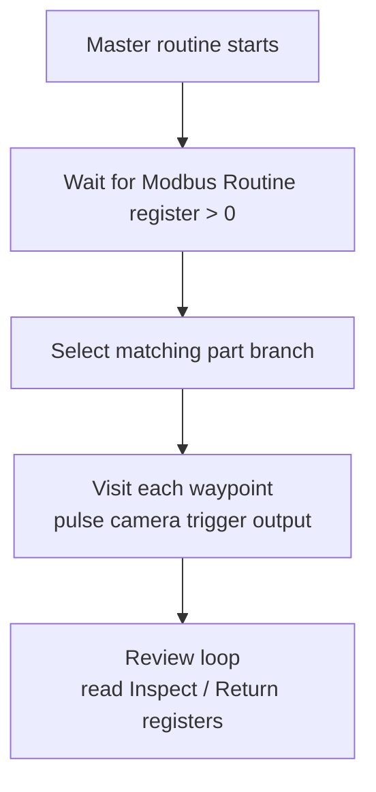

# Compile and deploy the schema

**Prerequisites:** at least one routine taught through phase 5 — see [Teaching a routine]({{ site.baseurl }}/teach-routine.html).

{: .warning }
**Compiling is not deploying.** Easy Inspection cannot push a routine onto the robot over the API; the robot's public interface allows listing, playing, and stopping routines, not creating them. Getting the compiled schema onto the robot is a manual step you perform once per change.

## What compiling produces

One **master schema** for the whole project: a single Standard Bots routine that contains every taught part routine as a branch, plus the plumbing that makes a run work.

The generated routine includes:

- A selector that waits on the Modbus **Routine** register and branches to the matching part
- Motion between home points and waypoints, planned around the no-go volumes
- Camera trigger and tower light output pulses at each waypoint
- The review loop that reacts to the **Inspect** and **Return** registers
- The PC's address as the Modbus host

## Deploy to the robot

1. In Easy Inspection, compile the master schema (Routine Editor phase 5).
2. Open the project's **Master schema** section and use **Go to master schema upload page** to get the compiled output.
3. On the robot's tablet, open its routine editor and create a routine. **The name must match the robot routine name configured in the schema options** — by default this is `Easy Inspection`.
4. In that routine's schema view, use **Update Routine** and paste the compiled JSON.
5. Back in Easy Inspection, use **Load master as default** so the app plays this routine.

{: .screenshot }
The project Master schema section with red boxes around Go to master schema upload page and Load master as default.

{: .screenshot }
The Standard Bots tablet routine editor with a red box around the Update Routine control where the compiled JSON is pasted.

### Name matching

At run time the app finds the routine on the robot **by name**. If the names differ, playing fails with a message that no robot routine of that name exists. Either rename the routine on the tablet or change the expected name in the schema options — they simply have to agree.

## Verify the deployment

Before running parts:

1. Confirm the routine exists on the robot with the expected name.
2. Confirm the [Modbus server]({{ site.baseurl }}/modbus.html) is running and the robot can reach it — the routine blocks waiting on the **Routine** register, so an unreachable PC looks like a robot that does nothing.
3. Run a validation scan — see [Test run and validation]({{ site.baseurl }}/test-run.html).

| Symptom | Cause |
|---|---|
| "No robot routine named ..." | Routine not created on the tablet, or the names differ |
| Routine plays but the arm never moves | Waiting on the **Routine** register; Modbus is unreachable or the register is zero |
| Arm runs the wrong part | Routine indices changed after routines were added, reordered, or deleted; recompile and redeploy |
| Arm moves but no results appear | Camera trigger not wired, or the accumulator is not incrementing — see [Cognex vision setup]({{ site.baseurl }}/cognex.html) |

## When to redeploy

Any change to taught data requires a fresh compile **and** a fresh paste onto the robot:

- Adding, removing, or reordering routines in the project
- Capturing, deleting, or reordering waypoints
- Changing no-go volumes or home points
- Changing the PC's IP address, which changes the embedded Modbus host

{: .warning }
The most common false alarm in this system is a change that appears to have no effect. Nine times out of ten the schema was recompiled but never re-pasted onto the robot, so the controller is still executing the previous version.

## Next

Continue to [Test run and validation]({{ site.baseurl }}/test-run.html).
