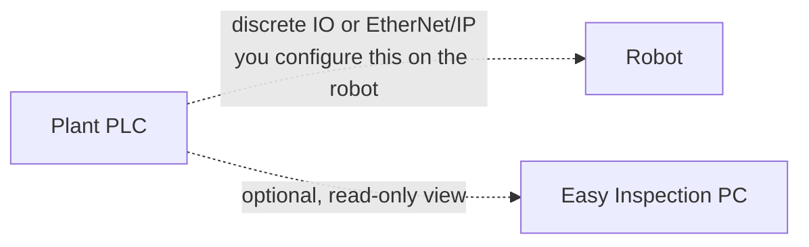

# External control and PLC integration

**Prerequisites:** a working station — see [Factory mode setup]({{ site.baseurl }}/factory-config.html).

This page is about the boundary between what Easy Inspection provides and what you have to build yourself. Read it before promising a customer that the cell integrates with their line.

## What the app actually does

When an operator presses **Play** in factory mode, the app sets the robot's control mode to routine editor and plays the master routine over the REST API. **Stop** does the same in reverse. Coordination during the run happens through the three Modbus registers.

That is start/stop control of production, driven by a person at a PC.

## What it is not

{: .warning }
Easy Inspection does not configure Standard Bots External Control. If your cell needs a PLC or hardwired signals to start and stop production independently of this PC, you must set that up on the robot controller yourself, using discrete IO or EtherNet/IP per Standard Bots documentation.

Concretely, the app does not provide:

- A hardwired or fieldbus start input
- Cycle-complete, fault, or ready outputs to the line
- Safety interlocking of any kind
- Operation with the PC switched off

The distinction that matters: **the PC is a required participant.** If the PC is off, the routine has nothing to read its Modbus registers from and no one to press Play.

## Comparing the options

| Requirement | Easy Inspection alone | Requires robot-side external control |
|---|---|---|
| Operator starts a run at the station | Yes | — |
| Select part program at the station | Yes, Modbus **Routine** register | — |
| Review and rescan a failed feature | Yes | — |
| PLC starts production | No | Yes |
| Line signals cycle complete or fault | No | Yes |
| Run with the PC powered off | No | Yes |
| Safety interlocks | No | Safety system, not either of these |

## If you need PLC control

Two architectures work, and they are not mutually exclusive.

### A. Robot-side external control, PC as inspection service

The PLC starts and stops the robot through discrete IO or EtherNet/IP configured on the controller. The robot routine still reads the Modbus registers from the PC for part selection and review, and the PC still polls the camera and records results.

This is the right shape when the line owns the cycle. Note that the routine will still block on the Modbus registers, so the PC must be running even though it no longer starts the cycle.

### B. PLC as a Modbus client alongside the robot

The PC's Modbus server accepts multiple clients, so a PLC can read the same registers the robot reads, for monitoring or coarse coordination.

{: .warning }
The three registers are written by the app, not by external clients. Treat them as read-only status from a PLC's point of view. Do not design a scheme where the PLC writes them; the app will overwrite the values on its own schedule.

## Design guidance

- **Decide who owns the cycle first.** Retrofitting PLC ownership onto a station commissioned around the HMI means revisiting the robot program, not just the PC.
- **Do not put the PC in a safety path.** Software stops in this app are convenience stops. Safety functions belong in the safety circuit.
- **Plan for the PC being unavailable.** Decide up front what the line should do when the station PC is rebooting or has failed.
- **Keep the Modbus link on a stable segment.** The routine blocks on register reads, so a flaky link looks like a hung robot.
- **Recompile after any address change.** The PC address is embedded in the compiled schema; a new IP means a recompile and redeploy — see [Compile and deploy the schema]({{ site.baseurl }}/deploy-schema.html).

## Register reference

Repeated here for convenience; full context in [Modbus setup]({{ site.baseurl }}/modbus.html).

| Offset | Name | Values |
|---|---|---|
| `0` | Inspect | `0` idle, `1..N` feature to re-inspect |
| `1` | Return | `0` wait, `1` return home |
| `2` | Routine | `0` wait, `1..N` part routine index |

All three are 16-bit unsigned holding registers, big-endian, served on port 502 by default.
