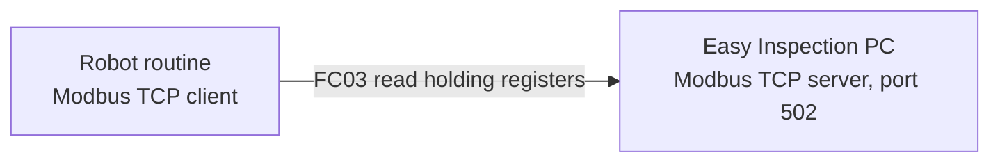

# Modbus setup

**Prerequisites:** the app installed, and the robot able to reach the PC over the network.

Modbus is how the PC and the running robot routine coordinate. Get the direction right and the rest is straightforward.

## Who is the server

**The Easy Inspection PC is the Modbus TCP server. The robot is the client.**

The PC owns three holding registers and writes values into them. The robot's routine reads those registers with function code 3. The PC never reads registers from the robot.

## Register map

All three are 16-bit unsigned holding registers, big-endian.

| Offset | Name | Values | Meaning |
|---|---|---|---|
| `0` | **Inspect** | `0` = idle, `1..N` | Which feature to re-inspect during review |
| `1` | **Return** | `0` = wait, `1` = return | Tells the arm to go back to home after a review stop |
| `2` | **Routine** | `0` = wait, `1..N` | Which part routine inside the master schema to run |

### How they are used during a run

| Moment | Register action |
|---|---|
| Operator starts a scan | **Routine** is set to the selected routine's index, then the master routine is played |
| Initial scan finishes | **Inspect** and **Return** are cleared; **Routine** stays latched |
| A feature is sent for re-inspection | **Return** set to `0`, then **Inspect** set to the feature index |
| Operator confirms the re-inspection | **Return** set to `1`, then both are cleared |
| Scan exited | All three cleared |

**Routine** is deliberately left latched when the other two are cleared, so an early review action cannot wipe the routine selection before the robot has read it.

## Enable the server on the PC

Open **Settings**, then **User preferences**, and find the **Modbus TCP server** section.

| Setting | Default | Notes |
|---|---|---|
| Enable on launch | On | Start the server automatically |
| Listen port | `502` | Standard Modbus TCP port |

Buttons on the same panel:

- **Start / restart server**
- **Self-test** — issues a local read to confirm the server answers
- **Open firewall for Modbus** — creates the inbound rule, requires administrator approval

The panel also shows the status, the connected client count, and the address of the last client that connected.

{: .screenshot }
The Modbus TCP server section of User preferences with red boxes around the status readout, the Self-test button, and the Open firewall for Modbus button.

## Configure the robot as a client

On the robot, create an equipment entry of type Modbus TCP client:

| Setting | Value |
|---|---|
| Name | `Master` |
| Enabled | On |
| IP address | The PC's LAN IPv4 address shown in the Modbus panel |
| Port | `502`, or the port you configured |
| Timeout | `10`, increase if the link is unstable |

{: .screenshot }
The Standard Bots equipment page with a red box around the Modbus TCP client entry showing the PC IP address and port 502.

{: .warning }
Never enter `0.0.0.0` as the client IP. That is only valid as a listen address on the server side.

### Pick the right network interface

This is the most common failure in the whole system.

A station often has the Cognex camera on a wired NIC and the robot controller on a different interface. Both can be on similar-looking subnets such as `192.168.1.x` while being **physically separate networks**. The robot must be pointed at the PC address that the *controller* can reach, which is frequently not the camera NIC address.

Use the address the app reports as the preferred LAN address, and verify by watching the client count go above zero when you enable the robot's Master entry.

## Verify the link

Work through these in order. Each one isolates a different layer.

1. Modbus panel shows the server **listening**.
2. **Self-test** succeeds. If not, the server is not running or the port is wrong.
3. Enable the client on the robot. The panel should show **at least one client** and a last-client address belonging to the robot, not `127.0.0.1`.
4. If the self-test passes but the robot cannot connect, it is the Windows firewall or the wrong NIC.

| Symptom | Likely cause |
|---|---|
| Self-test fails | Server not started, or port conflict |
| Self-test passes, zero clients | Wrong IP on the robot, firewall, or client disabled |
| Client connected but values never change | Wrong register offsets or data format in the robot config |
| Intermittent drops | Timeout too low, or a shared or congested link |

## Two ways the robot reads the registers

| Approach | How it works |
|---|---|
| **Compiled schema** (normal) | The generated routine opens its own Modbus client and reads the registers directly. This is what Easy Inspection produces. |
| **Hand-built routine** | You build the routine on the tablet using an equipment Master and network request steps that read registers into variables. |

With the compiled schema you do not strictly need the equipment Master entry, but configuring it anyway is the easiest way to prove the robot can reach the PC. If the Master shows red for the same address and port, the compiled routine will fail too.

### Modbus host in the schema

When you compile a routine, the app embeds the PC's address as the Modbus host. It fills this in automatically from the running server when the field is blank. If the PC's address changes, recompile and redeploy so the routine points at the new address.

## Next

Continue to [Projects and routines]({{ site.baseurl }}/projects-and-routines.html).
