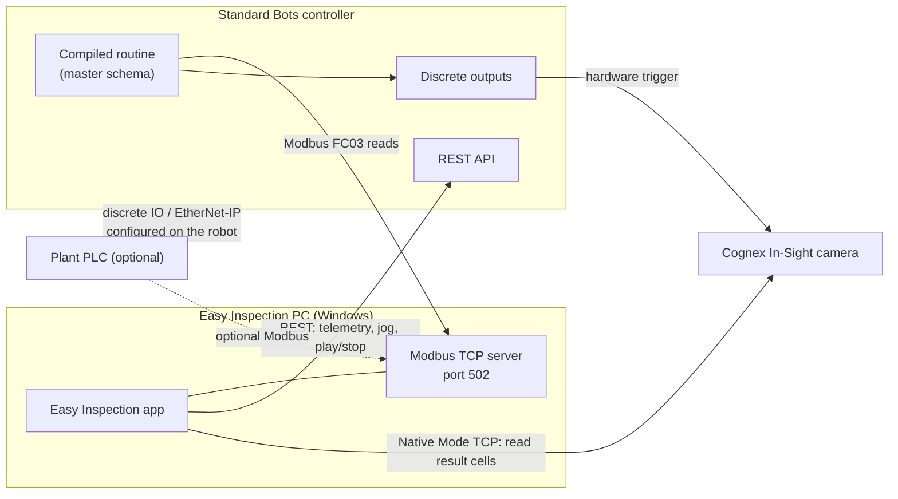
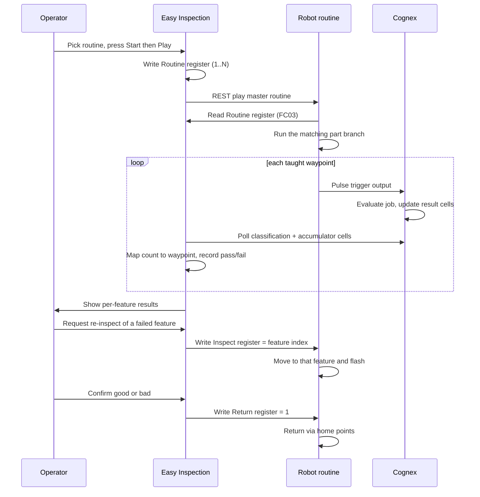

# System and control model

This page explains what talks to what. Understanding it up front makes the rest of the setup section obvious, and it is the difference between a station that works and one that fails intermittently on the floor.

## The four participants

| Participant | Role |
|---|---|
| **Easy Inspection PC** | Teaching UI, run HMI, Modbus TCP **server**, Cognex client |
| **Standard Bots controller** | Executes the routine, drives the arm, pulses the camera trigger output |
| **Cognex camera** | Runs your vision job; exposes result cells the PC reads |
| **PLC** (optional) | Real external start/stop and plant interlocks, configured on the robot |

The important asymmetry: **the PC is the Modbus server and the robot is the Modbus client.** The robot's routine reads holding registers from the PC, not the other way round. See [Modbus setup]({{ site.baseurl }}/modbus.html).

---

## Three different meanings of "control"

This trips people up more than anything else, because all three are called control somewhere in the stack.

| Control concept | What the app actually does | When it is used |
|---|---|---|
| **API control** | Sets the robot control mode to `api`, then issues individual Cartesian moves | Teaching and jogging in [Move]({{ site.baseurl }}/move.html) |
| **Routine play/stop** | Sets control mode to `routine_editor`, then plays or stops a named routine | Every inspection run, including factory mode |
| **True external control** | Nothing — this is configured on the robot, not here | A PLC starting and stopping production without the PC HMI |

### What this means in practice

When an operator presses **Play** in factory mode, the app is not using Standard Bots External Control. It is calling the REST API to play a routine, and stopping it the same way. Functionally it looks like external start/stop, so the station behaves like an automated cell, but it is an emulation performed by the PC.

{: .warning }
If your cell requires a PLC or hardwired signals to start and stop production independently of this PC, you must configure External Control on the Standard Bots controller yourself, using discrete IO or EtherNet/IP per Standard Bots documentation. Easy Inspection does not set that up, and the Modbus registers described here do not replace it. See [External control and PLC integration]({{ site.baseurl }}/external-control.html).

---

## How one inspection run flows

Three mechanisms are doing different jobs at the same time:

1. **REST** starts and stops the routine.
2. **Modbus** tells the running routine *which* part program to run and, after the scan, which feature to revisit.
3. **Cognex Native Mode** is how results get back to the PC. The camera is triggered by the robot's discrete output, not by the PC.

The PC never sends motion commands during a run. Once the routine is playing, the robot is executing its own program, and the PC only exchanges small integers over Modbus and reads cells from the camera.

---

## Why the camera trigger is hardware

The robot pulses a discrete output at each taught waypoint, which fires the camera. The PC polls the camera for results separately. This keeps the trigger timing tied to the arm's actual position rather than to network round-trips from the PC, which matters when the arm is moving between closely spaced features.

The consequence for you as an integrator: the camera trigger wiring is part of the robot's IO, and if the trigger is not wired or the output is not configured, the run will appear to work but no new results will ever arrive. See [Cognex vision setup]({{ site.baseurl }}/cognex.html).

---

## Two ways to run the station

| Mode | Who starts the run | What the operator can reach |
|---|---|---|
| **Test run** (unlocked) | You, from the full app | Everything, including teaching |
| **Factory mode** (locked) | Operator, from the run screen only | One project, run screen only |

The run procedure itself is identical in both. Factory mode simply hides the rest of the application and pins the station to one project. That is why the [Operator manual]({{ site.baseurl }}/operator/) and [Test run and validation]({{ site.baseurl }}/test-run.html) describe the same sequence from two different angles.

{: .screenshot }
Side-by-side of the app in normal mode and in factory mode, with a red box around the hidden sidebar area and the Factory mode chip in the title bar.

---

## What has to be true before production

A run touches every subsystem, so any one of these will stop it:

- Robot reachable over REST, with a valid API token — [Connect the robot]({{ site.baseurl }}/connect-robot.html)
- Correct tooltip (the Final Cognex tip, not the bare wrist flange) — [End effector and tooltip]({{ site.baseurl }}/end-effector.html)
- Cognex job trained with a pass/fail cell and a count cell — [Cognex vision setup]({{ site.baseurl }}/cognex.html)
- Modbus server running on the PC and reachable from the robot — [Modbus setup]({{ site.baseurl }}/modbus.html)
- Master schema compiled and loaded onto the robot — [Compile and deploy the schema]({{ site.baseurl }}/deploy-schema.html)

[Troubleshooting]({{ site.baseurl }}/troubleshooting.html) is organized around these same five areas.
