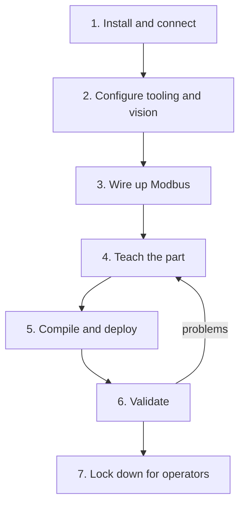

# Typical workflow

The whole commissioning process on one page, from an empty PC to a locked operator station. Each step links to the page with the detail.

---

## 1. Install and connect

1. Install the app — [Install and first launch]({{ site.baseurl }}/install.html)
2. Enter the robot URL and API token in **Settings** then **Network**, and save
3. **Connect telemetry**, then **Unbrake robot**, then **Assert API control** — [Connect the robot]({{ site.baseurl }}/connect-robot.html)
4. Confirm the 3D view tracks the real arm

**Done when:** telemetry is live and API control is held.

## 2. Configure tooling and vision

1. Select the Final Cognex tooltip on the robot via **SB Controller** — [End effector and tooltip]({{ site.baseurl }}/end-effector.html)
2. Confirm the end effector widget on Home is green
3. Train your Cognex job with a classification cell and an accumulator cell — [Cognex vision setup]({{ site.baseurl }}/cognex.html)
4. Set the camera IP and cell addresses in **Settings**, and run the protocol probe

**Done when:** the tooltip gate is satisfied and the camera returns a pass/fail and a count that increments once per trigger.

## 3. Wire up Modbus

1. Enable the Modbus server in **Settings** then **User preferences** — [Modbus setup]({{ site.baseurl }}/modbus.html)
2. Open the Windows firewall for Modbus
3. Configure the robot as a Modbus TCP client pointing at the PC's LAN address on port 502
4. Confirm the client count on the PC goes above zero

**Done when:** the robot appears as a connected client, using the robot-facing NIC address.

## 4. Teach the part

1. Create a project, then a routine — [Projects and routines]({{ site.baseurl }}/projects-and-routines.html)
2. Work the five phases — [Teaching a routine]({{ site.baseurl }}/teach-routine.html)
   1. Train image
   2. No-go volumes (at least one)
   3. Capture waypoints, in inspection order
   4. Home points, with waypoints assigned
   5. Compile the master schema
3. Use **Simulate** to preview the path before running on hardware

**Done when:** the routine simulates cleanly and compiles.

## 5. Compile and deploy

1. Compile the master schema
2. Copy the compiled JSON to the robot's routine editor via **Update Routine** — [Compile and deploy the schema]({{ site.baseurl }}/deploy-schema.html)
3. Make sure the routine name on the robot matches the configured name
4. **Load master as default** in the project

**Done when:** the robot has a routine of the expected name containing the current schema.

## 6. Validate

1. Clear the cell and station someone at the hardwired e-stop
2. Run a scan from **Test Run** — [Test run and validation]({{ site.baseurl }}/test-run.html)
3. Check motion, triggering, and result mapping
4. Run once with the result source set to **Manual** to test motion independently of vision
5. Run a known-bad part and confirm it is reported bad on the right feature

**Done when:** three clean runs on good parts and one correct rejection.

## 7. Lock down for operators

1. Export a `.ie` backup — [Projects, storage and backup]({{ site.baseurl }}/data.html)
2. Configure **Factory config**: project, cell addresses, unlock password — [Factory mode setup]({{ site.baseurl }}/factory-config.html)
3. Change the password from the default
4. Enable Modbus on launch and telemetry autoconnect so a reboot recovers unattended
5. Turn on factory mode
6. Hand operators the [Operator manual]({{ site.baseurl }}/operator/)

**Done when:** the station boots into the run screen and an operator can run parts without an integrator.

---

## Changing a part later

| Change | What to redo |
|---|---|
| Cognex job retrained, same cells | Nothing in the app; re-validate |
| Cognex cell addresses changed | Update run preferences and factory config |
| Waypoints, volumes, or homes edited | Recompile, redeploy, re-validate |
| Routine added, deleted, or reordered | Recompile, redeploy, re-verify every routine index |
| PC IP address changed | Update the robot's Modbus client, recompile, redeploy |
| App upgraded | Back up, upgrade, run one validation scan |

{: .warning }
Recompiling without re-pasting the schema onto the robot is the most common reason a change appears to do nothing. The controller keeps running the previously deployed version.
